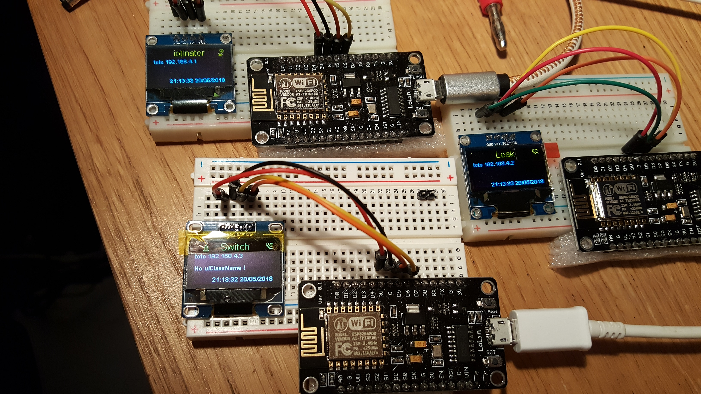

# iotinator
The global multipurpose home iot solution.

This is the master module of the iotinator framework.

It runs on esp8266 hardware (Investigating esp32 hardware too), connected to a SIM800 chip and an Oled screen, and offers an interface to slave modules in order to monitor them through SMS and webApps.

It connects to a domestic Wifi network and exposes a "private" Wifi network to communicate with slave modules.

It defines APIs to communicate with the modules, and dispatches and forwards SMS to them, and sends their responses back.

It also provides an API so that modules can record logs, stats, etc on a website, and expose a web UI for module configuration and status diplay.

Configuration is persisted in EEPROM.

Waiting to solve stability issues with cheap GSM boards, gsm handling has been disabled. Current time is fetched from NTP servers once Home Wifi is configured and connected.

You'll need to clone these repositories into your arduino "libraries" directory to be able to compile:

- https://github.com/reivaxy/XOLEDDisplay.git 
- https://github.com/reivaxy/XIOTDisplay.git
- https://github.com/reivaxy/XEEPROMConfig.git
- https://github.com/reivaxy/XUtils.git
- https://github.com/reivaxy/XIOTModule.git

And some libraries that can be found through the Arduino IDE

TODO: list the libraries :)

Picture of the early prototype:

Picture of the swarm: one master, two slaves:

