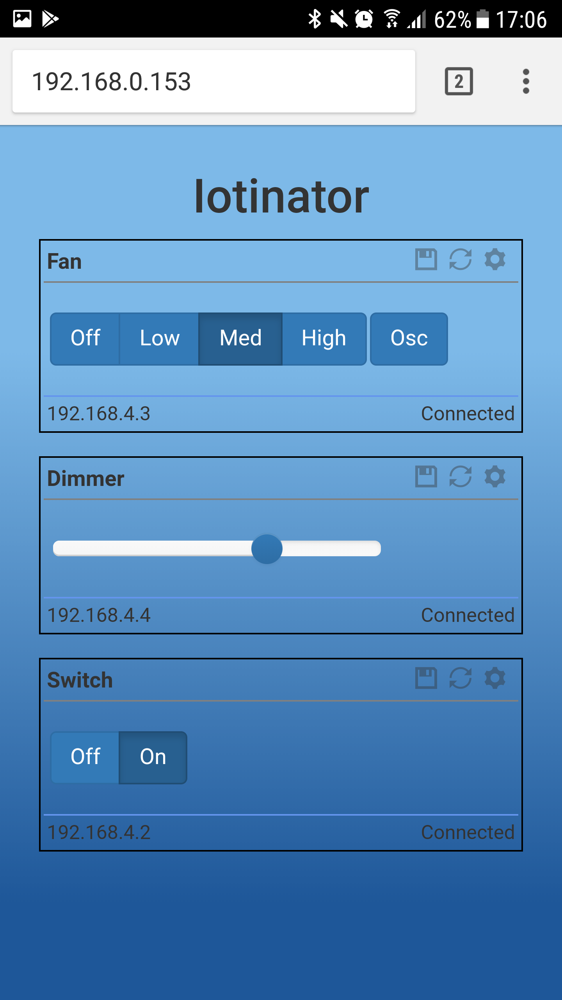

# iotinator
### The global multipurpose home iot solution.

TL;DR: This is not just a framework or a library, it's an iot application you can already use. Please check the Wiki for a detailed walk-through introduction and many pictures: https://github.com/reivaxy/iotinator/wiki

You can easily build already available modules*, which are usually just a few dollars of very easy to find hardware.

But you can easily design your own modules to fit your needs: in just a few lines of code, you can design a module able to connect to a wifi network, and equipped with a tiny Oled screen, to monitor something or control it, and make its collected data and actions available through a webApp showing all connected modules, but also through sending and receiving GSM text messages.

Some can operate using a small battery, others will need a power adapter, others can run directly on your main power source, or on a solar source.

Examples of modules are:
- Turning on/off a lamp, a heater, an air conditionner (Existing https://github.com/reivaxy/iotSwitch module, work in progress)
 
 Here is a picture of this module's Oled display (Don't be fooled by it's blurry aspect, the screen is actually sharp and good looking)
 
  
  
- A programmable scheduler to turn on/off random devices
- Monitoring for water leaks
- Monitoring for fire/fumes
- Monitoring an aquarium parameters to alert when something's off (https://github.com/reivaxy/aquaMonitor)
- You name it !

(*) ok, not many are available at this time, it's a work in progress. Hopefully some people join, design and share their own!

### You read that far and want to know more ? Nice !

Let's dive deeper:

Xiot is a framework consisting of set of classes available as libraries, that make easy Wifi connection, Oled screen display, information exchange, web app interface.

An Xiot swarm is composed of a iotinator "master" module, and a bunch of agent modules (bunch start at one...).

Iotinator is the master module of the Xiot framework.

Its goal is to control many different devices by SMS or through a webApp (or mobile app), it's the common entry (and exit) point of communication. Once the master module is configured, adding a module is zero configuration: power the module up, reset the master, the new module will connect, and they'll negociate what happens next, which is use a private wifi network. Pre existing and connected modules will be disconnected for 30 seconds and automatically reconnect.

  

Designing a new module can be just a few lines of code, depending on its complexity, of course.

The master and the modules run on esp8266 hardware (will investigate esp32 hardware too, one board having an Oled screen already integrated), connected to a SIM900 chip and an Oled screen, and offers an interface to agent modules in order to monitor them through SMS and webApps.

The Iotinator master module exposes APIs to communicate with the modules, and dispatches and forwards messages received by SMS or from the web app to them, and sends their responses back.

These API also allow modules to record logs, stats, etc on a website, and expose a web UI for module configuration and status diplay.

It connects to a domestic Wifi network to get time through NTP servers (but it can also get time from GSM network), and record logs and stats on a web server, much like http://reeftankalert.com/chart.php) and exposes a "private" Wifi network to communicate with agent modules.

Configuration is persisted in EEPROM, it uses network autodiscovery, (re)connection management is automatic.

# Current Status (2018/05/27):

Waiting to solve stability issues with cheap GSM boards, gsm handling has been disabled.

GSM will be an option, the framework being able to work just using internet.

But GSM is nice in case of power outage (modules can have batteries, but my adsl box doesn't), and also to handle security
(sending codes to validate authentication for instance)

Current time is fetched from NTP servers once Home Wifi is configured and connected.

The framework currently allows to create a new module in :
* a few lines of CPP in which you implement your custom eeprom persisted settings and behaviors, including displaying custom info on the Oled screen.
* a few lines of JS and CSS in which you implement the custom UI elements exposed on the webApp

The framework takes care of wifi connection to the iotinator master, registration, data exchange, polling, time and display management.

To create a new module, just get the iotSwitch repo, rename it, and the files within, and the classes they contain, and the code is totally self explanatory (No, just kidding).

For now the UI files (js, css) of each module are in the iotinator repository, which is not awesome...

The UI framework is taking care of displaying one block for each module connected with their connection information and providing the module's generic and custom data, and each module needs to provide the UI elements to display/handle its custom data within these blocks, and send actions to the REST api.

The UI part is not offering enough in terms of framework, and may change drastically. I'd like to investigate a vuejs version. Several UIs could easily be made available at the same time anyway.

Most UI files (all but one) need to be hosted on a public web server, because of low capacity on ESP8266 both in terms of storage and performances. I don't want to bloat it with an SD card, it has better things to do.

The js and css files are loaded from the minimalist loader page served by the module to build the webApp, which allows to modify the webApp without the need for flashing the ESP8266 to improve it, or translate messages. This also makes using images really easier, and contributes to faster page loading, since the wifi module does not have a great bandwidth (and does not process multiple requests simultaneously).

Of course you'll need to add the .htaccess directive:

Header set Access-Control-Allow-Origin "*"

In the wiki, you'll find all the information to setup your development environment, the libraries to install, and the necessary hardware.

https://github.com/reivaxy/iotinator/wiki

Picture of the early prototype with its SIM800 board:

Screen shot of the first draft of the webApp, showing 2 connected modules.

The data is refreshed every 10 seconds and reflects the status of the modules. A click on the button allows to control the Switch.

The UI is using Backbone and Bootstrap. A less than 1K page is served by the master ESP8266, and the rest of the API (libs, css, js) are hosted on a regular public server.

It's fast and light !

This one is basic but some will be more complex soon (Most of it coming from my previous project https://github.com/reivaxy/aquaMonitor/blob/master/res/webApp.png)

